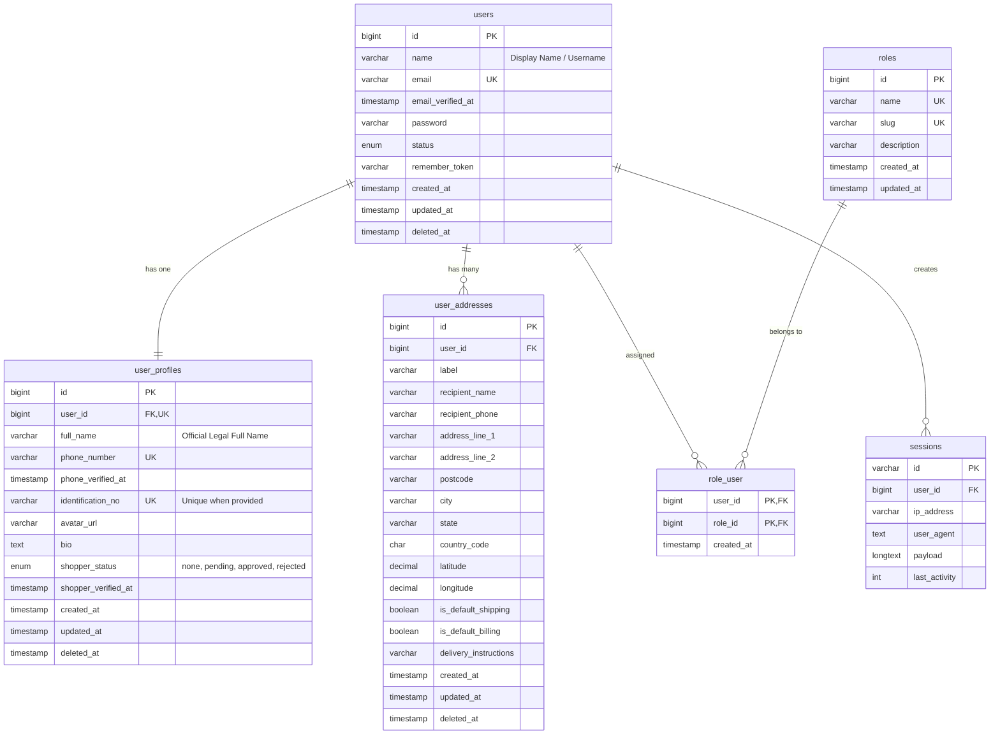

# PESGO - Pelan Reka Bentuk Pangkalan Data Modul 1
**Modul 1: Modul Pengurusan Pengguna (User Management Module)**  
**Peranan:** Senior Laravel Software Architect & Lead Database Engineer  
**Status:** Pelan Reka Bentuk Dikemas Kini (Updated Design Specification - Awaiting Final Approval)  
**Pangkalan Data Sasaran:** MySQL 8.0.31 (`pesgo`) | **Rangka Kerja:** Laravel 12.68.0 | **PHP:** 8.2.12  

---

## 1. Objektif Pangkalan Data Modul 1 (Module 1 Database Objectives)

Modul 1 merupakan asas identiti, kawalan akses, dan keselamatan bagi keseluruhan ekosistem **PESGO (Personal Shopper and Group Order)**. Matlamat utama reka bentuk pangkalan data ini adalah:

1. **Integriti Identiti & Keselamatan Tinggi (Enterprise Security & Integrity):**
   Menyediakan pengesahan pengguna (*authentication*) yang kebal daripada kebocoran kredensial, menyokong penyulitan piawai industri (Bcrypt/Argon2id), dan menjamin keunikan identiti (emel dan nombor telefon).
2. **Pengasingan Kebimbangan Domain (Separation of Concerns / Clean Data Modeling):**
   Mengasingkan data pengesahan teras (*core auth credentials*), profil peribadi rasmi (*user profile*), buku alamat (*address book*), dan kawalan akses peranan (*RBAC*). Ini mengelakkan jadual `users` daripada menjadi "jadual gergasi" (*god table*) yang sarat dengan lajur *nullable*.
3. **Fleksibiliti Hubungan Berbilang Peranan (Multi-Role Persona):**
   Dalam model perniagaan PESGO, seorang pengguna boleh bertindak sebagai **Customer (Pembeli)** dalam sesuatu pesanan kumpulan (*group order*), dan boleh bertindak sebagai **Personal Shopper (Runner/Shopper)** dalam perjalanan belian yang lain. Skema menyokong fleksibiliti ini tanpa memerlukan pendaftaran akaun berasingan.
4. **Kebolehskalaan & Keserasian Masa Depan (Scalability & Future Module Readiness):**
   Menyokong integriti rujukan (*referential integrity*) bagi modul seterusnya (Modul 2: Katalog/Pesanan, Modul 3: Transaksi & Pembayaran) melalui penggunaan kunci asing (*foreign keys*) yang tepat, indeks carian yang optimum, dan strategi pemadaman lembut (*soft deletes*) yang selaras merentasi semua entiti bersekutu.

---

## 2. Entiti yang Dicadangkan & Justifikasi Kewujudan (Proposed Entities & Justification)

| Nama Entiti | Nama Jadual Fizikal | Justifikasi Kewujudan & Peranan Domain |
|---|---|---|
| **User** | `users` | Entiti akar keselamatan (*security root entity*). Menyimpan kredensial log masuk (emel, kata laluan hash), nama paparan sistem (*display name*), status kitaran hayat akaun, dan token sesi. Entiti ini kekal ramping (*lean*) untuk kepantasan proses pengesahan (*authentication query performance*). |
| **UserProfile** | `user_profiles` | Menyimpan maklumat peribadi rasmi pengguna (nama penuh rasmi mengikut dokumen pengenalan, nombor telefon, avatar, bio, serta pengesahan identiti Personal Shopper). Dilengkapi dengan kitaran hayat pemadaman lembut (*SoftDeletes*) yang selaras dengan entiti induk `users`. |
| **UserAddress** | `user_addresses` | Menyimpan pelbagai alamat penghantaran dan pengebilan bagi setiap pengguna (1:N). Menyokong penanda alamat utama (*default shipping/billing*), poskod, negeri, serta koordinat geografi (latitude/longitude) untuk penetapan zon Personal Shopper pada fasa seterusnya. |
| **Role** | `roles` | Menyimpan definisi peranan sistem (`admin`, `shopper`, `customer`). Membolehkan penambahan peranan operasi pada masa hadapan tanpa mengubah kod sumber atau skema pangkalan data. |
| **RoleUser** | `role_user` | Jadual perantara (*pivot table*) Many-to-Many antara pengguna dan peranan. Menghubungkan fleksibiliti dwi-persona PESGO (seorang pengguna boleh menjadi *Customer* dan *Shopper*). |

---

## 3. Reka Bentuk Jadual Terperinci (Complete Table Specifications)

### 3.1. Jadual: `users`
Entiti keselamatan utama bagi log masuk dan status akaun.

| Nama Lajur | Jenis Data | Nullable | Nilai Lalai | Kekangan / Indeks | Penerangan |
|---|---|---|---|---|---|
| `id` | `BIGINT UNSIGNED` | Tidak | Auto-Increment | `PRIMARY KEY` | Pengenal unik pengguna |
| `name` | `VARCHAR(255)` | Tidak | - | - | **Nama paparan sistem / Display Name / Username** |
| `email` | `VARCHAR(255)` | Tidak | - | `UNIQUE INDEX` | Emel unik untuk log masuk & notifikasi rasmi |
| `email_verified_at` | `TIMESTAMP` | Ya | `NULL` | - | Tarikh & masa pengesahan emel |
| `password` | `VARCHAR(255)` | Tidak | - | - | Kata laluan yang telah di-hash (Bcrypt/Argon2id) |
| `status` | `ENUM('active', 'pending', 'suspended', 'deactivated')` | Tidak | `'active'` | `INDEX(status)` | Status kitaran hayat akaun pengguna |
| `remember_token` | `VARCHAR(100)` | Ya | `NULL` | - | Token fungsi "Ingat Saya" (Laravel Auth) |
| `created_at` | `TIMESTAMP` | Ya | `NULL` | - | Tarikh rekod dicipta |
| `updated_at` | `TIMESTAMP` | Ya | `NULL` | - | Tarikh rekod dikemas kini |
| `deleted_at` | `TIMESTAMP` | Ya | `NULL` | `INDEX(deleted_at)` | Tarikh akaun dipadam secara lembut (*SoftDeletes*) |

*Kekangan Asing & Tingkah Laku:*
- Tiada kunci asing keluar dari jadual ini (ia adalah entiti induk).
- **Dasar Keunikan Emel:** Emel kekal unik secara mutlak. Pendaftaran baru menyemak akaun sedia ada (termasuk rekod `deleted_at` tidak kosong). Jika akaun dipadam lembut wujud, sistem menawarkan proses **Pengaktifan Semula Akaun (*Account Reactivation*)** dan bukannya membenarkan penciptaan akaun bertindih.

---

### 3.2. Jadual: `user_profiles`
Profil maklumat peribadi dan maklumat verifikasi Personal Shopper (Hubungan 1:1 dengan `users`).

| Nama Lajur | Jenis Data | Nullable | Nilai Lalai | Kekangan / Indeks | Penerangan |
|---|---|---|---|---|---|
| `id` | `BIGINT UNSIGNED` | Tidak | Auto-Increment | `PRIMARY KEY` | Pengenal unik profil |
| `user_id` | `BIGINT UNSIGNED` | Tidak | - | `FOREIGN KEY`, `UNIQUE INDEX` | Kunci asing ke `users.id` (1:1) |
| `full_name` | `VARCHAR(255)` | Ya | `NULL` | - | Nama penuh rasmi pengguna mengikut dokumen pengenalan diri |
| `phone_number` | `VARCHAR(30)` | Ya | `NULL` | `UNIQUE INDEX` | Nombor telefon rasmi pengguna (menjamin 1 individu = 1 akaun) |
| `phone_verified_at` | `TIMESTAMP` | Ya | `NULL` | - | Tarikh & masa pengesahan OTP nombor telefon |
| `identification_no` | `VARCHAR(50)` | Ya | `NULL` | `UNIQUE INDEX` | No. Kad Pengenalan / Pasport (Unik; wajib semasa permohonan Shopper) |
| `avatar_url` | `VARCHAR(2048)` | Ya | `NULL` | - | Pautan gambar profil avatar pengguna |
| `bio` | `TEXT` | Ya | `NULL` | - | Pengenalan ringkas (terutamanya bagi Personal Shopper) |
| `shopper_status` | `ENUM('none', 'pending', 'approved', 'rejected')` | Tidak | `'none'` | `INDEX(shopper_status)` | **Status kitaran hayat permohonan Personal Shopper** |
| `shopper_verified_at`| `TIMESTAMP` | Ya | `NULL` | - | Pengesahan rasmi Pentadbir untuk status Personal Shopper |
| `created_at` | `TIMESTAMP` | Ya | `NULL` | - | Tarikh rekod dicipta |
| `updated_at` | `TIMESTAMP` | Ya | `NULL` | - | Tarikh rekod dikemas kini |
| `deleted_at` | `TIMESTAMP` | Ya | `NULL` | `INDEX(deleted_at)` | Pemadaman lembut (*SoftDeletes*) selaras dengan `users` |

*Kekangan Asing & Tingkah Laku:*
- `FOREIGN KEY (user_id) REFERENCES users(id) ON DELETE CASCADE ON UPDATE CASCADE`
- **Dasar No. Pengenalan (`identification_no`):** Ditetapkan sebagai `UNIQUE NULLABLE`. Semasa pendaftaran akaun pembeli biasa, medan ini adalah pilihan (`NULL`). Apabila pengguna memohon menjadi Personal Shopper, medan ini menjadi **Wajib Diisi (*Mandatory*)**. Kekangan unik menjamin tiada dua akaun boleh berkongsi dokumen pengenalan yang sama (mematuhi prinsip: 1 individu sebenar = 1 akaun PESGO).
- **Aliran *Onboarding* Shopper:** Pengguna bermula dengan `shopper_status = 'none'`. Apabila memohon, status bertukar kepada `'pending'`. Pentadbir yang meluluskan akan menukar status kepada `'approved'`, mengisi `shopper_verified_at = NOW()`, dan menetapkan peranan `shopper` ke dalam `role_user`.
- **Tingkah Laku Kitaran Hayat (*Lifecycle Handling*):** Apabila `users` dipadam lembut, aplikasi melalui *Model Event* akan memadam lembut rekod `user_profiles` secara selaras (*cascading soft delete*).

---

### 3.3. Jadual: `user_addresses`
Buku alamat penghantaran dan serahan barang pengguna (Hubungan 1:N dengan `users`).

| Nama Lajur | Jenis Data | Nullable | Nilai Lalai | Kekangan / Indeks | Penerangan |
|---|---|---|---|---|---|
| `id` | `BIGINT UNSIGNED` | Tidak | Auto-Increment | `PRIMARY KEY` | Pengenal unik rekod alamat |
| `user_id` | `BIGINT UNSIGNED` | Tidak | - | `FOREIGN KEY`, `INDEX(user_id)` | Kunci asing ke `users.id` |
| `label` | `VARCHAR(50)` | Tidak | `'Rumah'` | - | Label pengecam (cth: 'Rumah', 'Pejabat', 'Kampung') |
| `recipient_name` | `VARCHAR(150)` | Tidak | - | - | Nama individu penerima bungkusan |
| `recipient_phone`| `VARCHAR(30)` | Tidak | - | - | Nombor telefon individu penerima bungkusan |
| `address_line_1` | `VARCHAR(255)` | Tidak | - | - | Alamat baris 1 (No. rumah, nama jalan/bangunan) |
| `address_line_2` | `VARCHAR(255)` | Ya | `NULL` | - | Alamat baris 2 (Tingkat, seksyen, fasa) |
| `postcode` | `VARCHAR(20)` | Tidak | - | `INDEX(postcode)` | Poskod kawasan penghantaran |
| `city` | `VARCHAR(100)` | Tidak | - | `INDEX(city)` | Bandar / Daerah |
| `state` | `VARCHAR(100)` | Tidak | - | `INDEX(state)` | Negeri |
| `country_code` | `CHAR(2)` | Tidak | `'MY'` | - | Kod negara ISO-3166-1 alpha-2 |
| `latitude` | `DECIMAL(10, 8)` | Ya | `NULL` | - | Koordinat GPS latitud serahan |
| `longitude` | `DECIMAL(11, 8)` | Ya | `NULL` | - | Koordinat GPS longitud serahan |
| `is_default_shipping` | `BOOLEAN` | Tidak | `FALSE` | `INDEX(user_id, is_default_shipping)` | Penanda alamat penghantaran utama |
| `is_default_billing`  | `BOOLEAN` | Tidak | `FALSE` | - | Penanda alamat invois utama |
| `delivery_instructions`| `VARCHAR(255)` | Ya | `NULL` | - | Nota serahan khas (cth: 'Tinggalkan di pondok guard') |
| `created_at` | `TIMESTAMP` | Ya | `NULL` | - | Tarikh rekod dicipta |
| `updated_at` | `TIMESTAMP` | Ya | `NULL` | - | Tarikh rekod dikemas kini |
| `deleted_at` | `TIMESTAMP` | Ya | `NULL` | `INDEX(deleted_at)` | Pemadaman lembut (*SoftDeletes*) |

*Kekangan Asing & Tingkah Laku:*
- `FOREIGN KEY (user_id) REFERENCES users(id) ON DELETE CASCADE ON UPDATE CASCADE`
- **Integriti Alamat Utama Tunggal (*Single Default Address Integrity*):**
  Penukaran alamat utama dikuatkuasakan secara atomik dalam lapisan perkhidmatan (`AddressService`) menggunakan **Database Transaction + Row-Level Locking (`lockForUpdate()`)** bagi menghalang sebarang isu persaingan serentak (*race condition*).

---

### 3.4. Jadual: `roles`
Jadual takrifan peranan sistem (*Role definitions*).

| Nama Lajur | Jenis Data | Nullable | Nilai Lalai | Kekangan / Indeks | Penerangan |
|---|---|---|---|---|---|
| `id` | `BIGINT UNSIGNED` | Tidak | Auto-Increment | `PRIMARY KEY` | Pengenal unik peranan |
| `name` | `VARCHAR(50)` | Tidak | - | `UNIQUE INDEX` | Nama paparan peranan (cth: 'Administrator', 'Personal Shopper') |
| `slug` | `VARCHAR(50)` | Tidak | - | `UNIQUE INDEX` | Pengecam sistem (cth: `'admin'`, `'shopper'`, `'customer'`) |
| `description` | `VARCHAR(255)` | Ya | `NULL` | - | Penerangan ruang lingkup kuasa peranan |
| `created_at` | `TIMESTAMP` | Ya | `NULL` | - | Tarikh rekod dicipta |
| `updated_at` | `TIMESTAMP` | Ya | `NULL` | - | Tarikh rekod dikemas kini |

*Data Benih Awal (Initial Seeders):*
1. `id: 1`, `name: 'Administrator'`, `slug: 'admin'`, `description: 'Pengurus sistem PESGO dan pemantau transaksi'`
2. `id: 2`, `name: 'Personal Shopper'`, `slug: 'shopper'`, `description: 'Penyedia servis belian peribadi dan pesanan kumpulan'`
3. `id: 3`, `name: 'Customer'`, `slug: 'customer'`, `description: 'Pengguna pembeli biasa dan penyertai pesanan kumpulan'`

---

### 3.5. Jadual: `role_user`
Jadual perantara Many-to-Many menghubungkan pengguna dan peranan.

| Nama Lajur | Jenis Data | Nullable | Nilai Lalai | Kekangan / Indeks | Penerangan |
|---|---|---|---|---|---|
| `user_id` | `BIGINT UNSIGNED` | Tidak | - | `FOREIGN KEY`, `INDEX` | Kunci asing ke `users.id` |
| `role_id` | `BIGINT UNSIGNED` | Tidak | - | `FOREIGN KEY`, `INDEX` | Kunci asing ke `roles.id` |
| `created_at` | `TIMESTAMP` | Ya | `CURRENT_TIMESTAMP` | - | Tarikh peranan diberikan kepada pengguna |

*Kekangan Primer & Asing:*
- `PRIMARY KEY (user_id, role_id)` *(Menghalang pemberian peranan berganda yang sama kepada pengguna).*
- `FOREIGN KEY (user_id) REFERENCES users(id) ON DELETE CASCADE ON UPDATE CASCADE`
- `FOREIGN KEY (role_id) REFERENCES roles(id) ON DELETE CASCADE ON UPDATE CASCADE`

---

## 4. Analisis: Pengubahsuaian vs Penggantian Jadual Lalai `users` Laravel

### Keputusan Seni Bina: **Ubah Suai Fail Migrasi Asas Secara Terus (Modify Baseline Migration)**

Laravel 12 menjana fail migrasi lalai:  
`database/migrations/0001_01_01_000000_create_users_table.php`

**Justifikasi Keputusan:**
1. **Pangkalan Data Belum Pernah Berjalan (*Greenfield Zero-Migration State*):**
   Oleh kerana `pesgo` masih belum mempunyai sebarang jadual dan arahan `php artisan migrate` belum pernah dijalankan, kita tidak perlu mematuhi kekangan skema pengeluaran lama (*legacy production constraints*).
2. **Mengelakkan Sisa Migrasi (*Migration Churn*):**
   Mencipta jadual dengan migrasi lalai dan serta-merta mencipta fail migrasi kedua `alter_users_add_status_and_soft_deletes.php` adalah amalan yang tidak kemas untuk projek baharu. Ia mencipta beban penyelenggaraan yang tidak wajar.
3. **Kekalkan Standard Ekosistem Laravel:**
   Kita mengekalkan jadual pembantu lalai Laravel 12 dalam fail yang sama iaitu:
   - `password_reset_tokens` (Penting untuk aliran lupa kata laluan).
   - `sessions` (Penting jika menggunakan pemacu sesi pangkalan data / stateful API).
4. **Tindakan Konkrit:**
   Kita akan memperluas definisi jadual `users` dalam fail migrasi asas tersebut dengan menambah medan `status` (Enum) dan `deleted_at` (SoftDeletes).

---

## 5. Seni Bina Pengesahan (Authentication Architecture)

### 5.1. Mekanisme Pengesahan: **Laravel Sanctum (Token-Based REST API)**
Bagi sebuah aplikasi perusahaan moden yang akan mempunyai frontend berasingan (Vue/React atau Aplikasi Mudah Alih Flutter/React Native) pada masa akan datang, pendekatan pengesahan yang disahkan ialah **Laravel Sanctum**.

1. **Pemasangan Pakej Semasa Pelaksanaan:**
   Menjalankan perintah rasmi Laravel 12:  
   `php artisan install:api`  
   Arahan ini secara automatik memasang pakej Sanctum, menerbitkan skema migrasi `personal_access_tokens`, dan menyediakan fail konfigurasi serta laluan `routes/api.php`.
2. **Aliran Pendaftaran (Registration Flow):**
   - Pengguna menghantar `email`, `password`, `name` (display name), dan `phone_number`.
   - Data disahkan melalui Form Request.
   - Pendaftaran dijalankan dalam **Database Transaction (`DB::transaction`)**:
     1. Rekod dicipta dalam `users`.
     2. Rekod dicipta dalam `user_profiles` (termasuk `full_name` jika dibekalkan).
     3. Peranan `customer` diserahkan secara automatik dalam `role_user`.
   - Menghasilkan token API selamat (*Sanctum Personal Access Token*) jika pendaftaran terus log masuk.
3. **Aliran Log Masuk (Login Flow):**
   - Pengguna menghantar `email` dan `password`.
   - Perlindungan *Rate Limiting* (5 percubaan seminit) dikuatkuasakan untuk menghalang serangan *brute force*.
   - Kata laluan disahkan menggunakan `Hash::check()`.
   - Akaun diperiksa statusnya (`status === 'active'`). Jika `'suspended'` atau `'deactivated'`, log masuk ditolak serta-merta dengan mesej HTTP 403 Forbidden.
   - Token peranti dikeluarkan (*plainTextToken*) dengan masa luput tertentu (*token expiration*).
4. **Aliran Log Keluar (Logout Flow):**
   - Token semasa dipadam secara kekal dari jadual `personal_access_tokens` (`$user->currentAccessToken()->delete()`).

---

## 6. Seni Bina Kawalan Capaian Berasaskan Peranan (RBAC Architecture)

### 6.1. Corak Reka Bentuk: Lean RBAC (Roles without Over-engineered Permissions Table)
- Modul 1 mempunyai 3 persona yang jelas: `admin`, `shopper`, `customer`.
- Sistem tidak memerlukan tetapan kebenaran dinamik peringkat butang (*granular permission editing via UI*) pada fasa ini.
- **Penyelesaian Elegan:**
  - Menggunakan jadual `roles` + `role_user`.
  - Dilengkapi dengan **PHP 8.2 Backed Enum** (`App\Enums\RoleSlug: string`) untuk menjamin keselamatan jenis (*type safety*) dalam kod PHP:
    ```php
    namespace App\Enums;

    enum RoleSlug: string {
        case ADMIN = 'admin';
        case SHOPPER = 'shopper';
        case CUSTOMER = 'customer';
    }
    ```
  - Kaedah pembantu pada Model `User`:
    `$user->hasRole(RoleSlug::ADMIN)` atau `$user->isShopper()`.
  - Mengintegrasikan **Laravel Gates & Middleware** (`role:admin`, `role:shopper`) untuk sekatan laluan API.

---

## 7. Seni Bina Profil Pengguna (User Profile Architecture)

1. **Prinsip Pengasingan Domain & Perlindungan PII:**
   - Jadual `users` semata-mata mengendalikan kredensial sistem dan status akaun.
   - Jadual `user_profiles` mengendalikan data personaliti rasmi (`full_name`) dan operasi.
2. **Pengesahan Personal Shopper (*Shopper Onboarding*):**
   - Pengguna biasa boleh memohon untuk menjadi Personal Shopper dengan memuat naik/mengemas kini maklumat `identification_no` (No. Kad Pengenalan/Pasport) dan nombor telefon yang disahkan.
   - Pentadbir (*Admin*) mempunyai kuasa untuk mengesahkan permohonan dengan mengisi medan `shopper_verified_at` dan menambah peranan `shopper` dalam jadual `role_user`.
3. **Integriti 1:1:**
   - Kunci asing `user_profiles.user_id` ditetapkan dengan indeks unik (`UNIQUE`), menjamin seorang pengguna hanya mempunyai tepat satu profil.

---

## 8. Sokongan Pelbagai Alamat (Multiple-Address Support Architecture)

1. **Kardinaliti 1:N (Satu Pengguna - Banyak Alamat):**
   - Pengguna boleh mendaftarkan alamat rumah, alamat pejabat, atau alamat transit serahan.
2. **Kekangan Alamat Utama Tunggal (*Single Default Address Constraint*):**
   - Hanya SATU alamat dibenarkan menjadi alamat lalai (`is_default_shipping = true`) bagi setiap pengguna pada satu-satu masa.
   - **Strategi Penguatkuasaan:**
     Penguatkuasaan logik ini diuruskan dalam lapisan perkhidmatan (`AddressService`) menggunakan **Database Transaction + Row-Level Locking (`lockForUpdate()`)**:
     ```php
     DB::transaction(function () use ($user, $newDefaultAddressId) {
         $user->addresses()->lockForUpdate()->where('is_default_shipping', true)->update(['is_default_shipping' => false]);
         $user->addresses()->where('id', $newDefaultAddressId)->update(['is_default_shipping' => true]);
     });
     ```
3. **Penyediaan Geolokasi (GPS Lat/Long):**
   - Lajur `latitude` dan `longitude` disediakan secara *nullable* untuk memudahkan pengiraan jarak dan pemadanan Personal Shopper dalam Modul 2 & 3.

---

## 9. Strategi Pemadaman Lembut & Penyahaktifan Akaun (Soft Deletes & Lifecycle Strategy)

1. **Mengapa Pemadaman Keras (*Hard Delete*) Dilarang dalam PESGO?**
   - Pemadaman rekod pengguna secara keras (`DELETE FROM users`) akan memutuskan integriti rujukan sejarah pesanan, rekod transaksi kewangan, dan log semakan undang-undang (*audit/compliance*).
2. **Pelaksanaan Dwi-Lapisan (*Dual-Layer Deactivation*):**
   - **Lapisan Status Operasi (`status`):**
     - `'active'`: Akaun berfungsi sepenuhnya.
     - `'suspended'`: Digantung oleh Admin kerana pelanggaran syarat/aduan pelanggan.
     - `'deactivated'`: Ditutup sendiri oleh pengguna melalui menu pengurusan akaun.
     - Pengguna dengan status ini dihalang daripada log masuk, tetapi datanya kekal utuh.
   - **Lapisan Pemadaman Undang-undang (`deleted_at` - SoftDeletes):**
     - Dilaksanakan secara selaras merentasi `users`, `user_profiles`, dan `user_addresses`.
     - Model Laravel secara automatik mengabaikan rekod ini dari pertanyaan biasa (`User::all()`).
3. **Strategi Pengaktifan Semula Akaun (*Account Reactivation*):**
   - Sekiranya pengguna yang pernah memadam akaun cuba mendaftar semula dengan emel yang sama, sistem mengesan rekod lama (`User::withTrashed()->where('email', $email)->first()`) dan memaparkan pilihan untuk memulihkan akaun lama melalui pautan pengesahan emel keselamatan.

---

## 10. Pertimbangan Masa & Jejak Audit (Timestamps & Audit Considerations)

1. **Standard `created_at` dan `updated_at`:**
   Semua jadual utama dilengkapi dengan cap masa piawai Laravel.
2. **Cap Masa Peristiwa Utama (*Event Timestamps*):**
   - `email_verified_at` (bila emel disahkan)
   - `phone_verified_at` (bila telefon disahkan melalui OTP)
   - `shopper_verified_at` (bila admin meluluskan pengguna sebagai Shopper)
3. **Log Keselamatan Sesi & IP:**
   - Jadual `sessions` merekod `ip_address` dan `user_agent` bagi membolehkan ciri paparan "Sesi Aktif" (*Active Sessions Management*) di mana pengguna boleh memantau dan menamatkan sesi peranti yang tidak dikenali.

---

## 11. Pertimbangan Keselamatan Siber & Pangkalan Data (Security Considerations)

1. **Penyulitan Kata Laluan (*Password Hashing*):**
   - Menggunakan piawaian **Bcrypt** (faktor beban 12 lalai Laravel 12) atau **Argon2id**.
   - Tiada kata laluan teks biasa disimpan dalam mana-mana jadual mahupun fail log.
2. **Medan Sensitif Tersembunyi (*Hidden Attributes / Serialization Security*):**
   - Atribut `$hidden` pada Model `User` dan `UserProfile` mesti melindungi:
     `password`, `remember_token`, dan `identification_no` (Kad Pengenalan) agar tidak terdedah dalam respons JSON API.
3. **Perlindungan Tugasan Pukal (*Mass Assignment Protection*):**
   - Penggunaan `$fillable` yang ketat pada setiap Model.
   - Medan status (`status`), kelulusan (`shopper_verified_at`), dan peranan **DILARANG SAMA SEKALI** diletakkan dalam `$fillable` yang boleh diubah melalui permohonan pengguna biasa (*Form Request protection*).

---

## 12. Notasi Hubungan Entiti (Entity Relationships Specification)

- **`users` (1) ---- (1) `user_profiles`**  
  *Setiap pengguna mempunyai tepat satu profil peribadi. Setiap profil merujuk kepada tepat satu pengguna.*
- **`users` (1) ---- (N) `user_addresses`**  
  *Setiap pengguna boleh memiliki sifar atau banyak alamat. Setiap alamat merujuk kepada tepat satu pengguna.*
- **`users` (M) <--- `role_user` ---> (N) `roles`**  
  *Seorang pengguna boleh memiliki pelbagai peranan (cth: Customer + Shopper). Suatu peranan boleh dimiliki oleh ramai pengguna.*
- **`users` (1) ---- (N) `sessions`**  
  *Seorang pengguna boleh log masuk melalui pelbagai peranti pada masa yang sama.*
- **`users` (1) ---- (N) `personal_access_tokens`**  
  *Seorang pengguna boleh memegang beberapa token API aktif merentasi peranti mudah alih dan pelayar web.*

---

## 13. Rajah Hubungan Entiti Visual (Mermaid ERD)



---

## 14. Cadangan Susunan Fail Migrasi Laravel (Recommended Migration Order)

1. **Prasyarat API (Sebelum Migrasi):**
   - Menjalankan `php artisan install:api` untuk memasang Laravel Sanctum dan menjana migrasi `personal_access_tokens`.
2. **`0001_01_01_000000_create_users_table.php` (Dikemas kini):**
   - Mencipta `users` (dengan `name` display, `status` Enum & `deleted_at`).
   - Mencipta `password_reset_tokens`.
   - Mencipta `sessions`.
3. **`2026_08_28_000001_create_roles_table.php`:**
   - Mencipta `roles`.
4. **`2026_08_28_000002_create_role_user_table.php`:**
   - Mencipta `role_user` (bergantung pada `users.id` dan `roles.id`).
5. **`2026_08_28_000003_create_user_profiles_table.php`:**
   - Mencipta `user_profiles` (mengandungi `full_name`, `deleted_at`, bergantung pada `users.id`).
6. **`2026_08_28_000004_create_user_addresses_table.php`:**
   - Mencipta `user_addresses` (bergantung pada `users.id`).

---

## 15. PENJELASAN MODEL PERNIAGAAN & IMPLIKASI SENI BINA (Business Model & Architectural Alignment)

Berdasarkan penjelasan rasmi model perniagaan PESGO:

1. **Pengguna Bukan Jenis yang Saling Eksklusif (*Non-Mutually Exclusive Personas*):**
   - Seorang pengunjung boleh melayari PESGO tanpa log masuk.
   - Pengguna berdaftar secara automatik mempunyai keupayaan sebagai pembeli (*Customer*).
   - Pengguna berdaftar boleh memohon dan diluluskan menjadi **Personal Shopper** tanpa kehilangan keupayaan sebagai pembeli.
   - Personal Shopper boleh menyertai Pesanan Kumpulan (*Group Orders*).
   - Pengguna boleh menjadi Personal Shopper tanpa menyertai Pesanan Kumpulan.
   - Pengguna boleh menyertai Pesanan Kumpulan tanpa menjadi Personal Shopper.
   - **Keputusan Seni Bina:** Model Many-to-Many `roles` + `role_user` menyokong kombinasi ini 100%. Setiap pengguna berdaftar memegang keupayaan asas pengguna/pembeli. Apabila diluluskan sebagai Personal Shopper, peranan `shopper` ditambah ke dalam `role_user` tanpa membatalkan akaun atau peranan sedia ada.

2. **Pesanan Kumpulan (*Group Order*) BUKAN Peranan Sistem (*Not a System Role*):**
   - Penyertaan atau penganjuran Pesanan Kumpulan adalah **hubungan aktiviti / transaksi domain**, bukannya peranan kekal (*permanent role*).
   - Oleh itu, **TIADA** peranan 'group_order' dalam Modul 1. Entiti pesanan kumpulan (`group_orders`, `group_order_participants`) diuruskan sepenuhnya dalam **Modul 2**.

3. **Prinsip: 1 Individu Sebenar = 1 Akaun PESGO (`identification_no`):**
   - Bagi menyokong integriti ini, `user_profiles.identification_no` (Kad Pengenalan/Pasport) ditetapkan sebagai **`UNIQUE NULLABLE`**:
     - Semasa pendaftaran pembeli biasa: Pilihan (`NULL`).
     - Semasa permohonan Personal Shopper: **Wajib Diisi (*Mandatory*)**.
     - Kekangan unik pangkalan data menghalang individu yang sama (atau individu yang pernah digantung) daripada mendaftar lebih daripada satu akaun atau menyalahgunakan identiti orang lain.

---

## 16. Perkara yang TIDAK Patut Dimasukkan dalam Modul 1 (Out of Scope for Module 1)

- ❌ **Katalog Produk, Barangan & Kedai:** (Milik Modul 2 - Shopping & Catalog Management).
- ❌ **Entiti & Logik Kumpulan Pesanan (Group Orders & Participants):** (Milik Modul 2 - Group Order Logic).
- ❌ **Dompet Digital (Wallet), Butiran Akaun Bank, Caj Servis & Baki Pembayaran:** (Milik Modul 3 - Payment & Settlement).
- ❌ **Ulasan & Penarafan Bintang Shopper (Shopper Ratings & Reviews):** (Milik Modul Pesanan & Maklum Balas).
- ❌ **Penjejakan Lokasi Langsung Masa Nyata (Live GPS Tracking):** (Milik Modul Penghantaran Lanjutan).

---

## 17. SENARAI SEMAK KELULUSAN AKHIR (APPROVAL CHECKLIST)

- [x] **1. Asas Pangkalan Data:** Pangkalan data `pesgo` bermula daripada sifar (*clean slate*) dan tiada jadual luar disentuh atau diguna semula.
- [x] **2. Penyelarasan Nama:** `users.name` bertindak sebagai Nama Paparan (*Display Name / Username*) dan `user_profiles.full_name` bertindak sebagai Nama Penuh Rasmi.
- [x] **3. Model Persona Tidak Eksklusif:** Menggunakan `roles` + `role_user` di mana pengguna boleh menjadi pembeli dan Personal Shopper serentak.
- [x] **4. Pengasingan Pesanan Kumpulan:** Tiada peranan 'group_order' dalam Modul 1; ia diuruskan sebagai aktiviti/transaksi dalam Modul 2.
- [x] **5. Integriti No. Pengenalan:** `identification_no` ditetapkan sebagai `UNIQUE NULLABLE` (wajib diisi semasa permohonan Shopper).
- [x] **6. Keunikan Emel & Pemadaman Lembut:** Emel kekal unik; akaun yang dipadam lembut diuruskan melalui aliran pengaktifan semula (*Account Reactivation*).
- [x] **7. Pemadaman Lembut Selaras:** `deleted_at` ditambah pada `user_profiles` untuk kitaran hayat pemadaman lembut yang konsisten bersama `users`.
- [x] **8. Integriti Alamat Utama:** Penukaran alamat lalai dikuatkuasakan melalui Transaksi Pangkalan Data dan Kunci Baris (*Row-level Locking*).
- [x] **9. Pengesahan API:** Laravel Sanctum diluluskan dan `php artisan install:api` akan dijalankan semasa pelaksanaan.
- [x] **10. Kredensial Pengesahan (Auth):** Disahkan bahawa Emel kekal sebagai kredensial log masuk utama. `phone_number` kekal di dalam `user_profiles`.
- [x] **11. Pelayaran Tetamu (Guest Browsing):** Disahkan bahawa pelawat luar boleh melayari PESGO tanpa memerlukan sebarang rekod di dalam jadual `users`.
- [x] **12. Kitaran Hayat Shopper:** Penambahan `shopper_status` ENUM ('none', 'pending', 'approved', 'rejected') untuk menjejak permohonan onboarding Personal Shopper secara terperinci.

---
*Dokumen ini dimuktamadkan untuk semakan akhir anda. Tiada sebarang migrasi pangkalan data mahupun kod aplikasi yang diubah suai sehingga kelulusan rasmi diberikan.*
